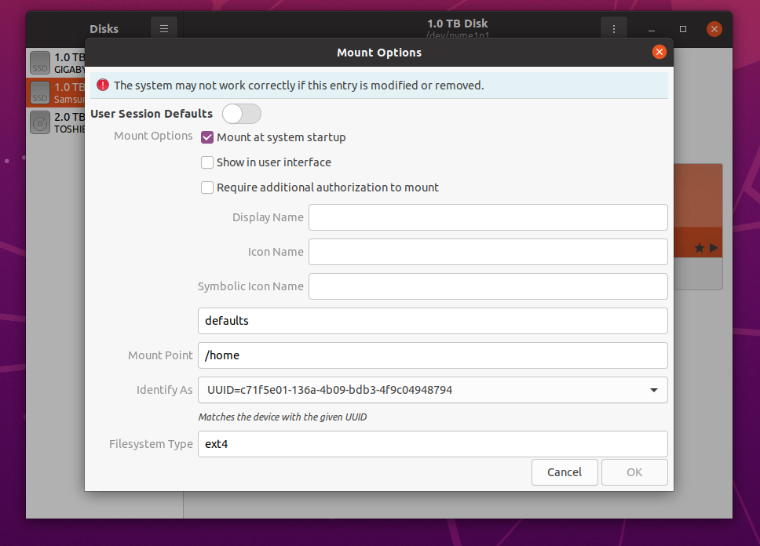

# AirSim-Docker
This dockerfile is used to build a docker image running Ubuntu 18.04, with ROS Melodic, Unreal Engine 4.25, AirSim 1.4, and GPU support.  
<br>


## Docker Pre-Reqs
1. docker installed on host (https://docs.docker.com/engine/install/ubuntu/)
    - Optional for QOL: remove need for sudo for docker (https://docs.docker.com/engine/install/linux-postinstall/)
1. nvidia-docker installed on host (https://docs.nvidia.com/datacenter/cloud-native/container-toolkit/install-guide.html#installing-on-ubuntu-and-debian). 
1. \> 120GB in directory where docker images are built. This is typically in "/", recommend to shift to "/home" or other directory with larger storage (https://www.guguweb.com/2019/02/07/how-to-move-docker-data-directory-to-another-location-on-ubuntu/)
1. *After Steps 2 & 3, `/etc/docker/daemon.json` should look similar to below. Key parameters are "data-root", "runtimes", and "default-runtime".
    ```
    {
        "data-root": "/home/jonyktan/docker",
        "runtimes": {
            "nvidia": {
                "path": "nvidia-container-runtime",
                "runtimeArgs": []
            }
        },
        "default-runtime": "nvidia"
    }
    ```
1. git clone https://github.com/Amigoshan/tartanair into same directory as dockerfile. Rename the git folder to "/tartanair/".
1. Ensure docker image directory has "defaults" options or NO "nosuid" option. Check this using `nano /etc/fstab`.
    - Edit using "Disks". Recommended to set "Mount Options" to "defaults". See image below, above "Mount Point".
      
<br>


## Build Docker Image
1. `cd /directory/containing/dockerfile/`
1. `docker build -t <IMAGE_NAME>:<IMAGE_TAG> --build-arg GITHUB_PAT=<PAT> .`
    - E.g. IMAGE_NAME = ue4, IMAGE_TAG = Tartan will build a docker image "ue4:Tartan".
    - `<PAT>` is your Github personal access token. (See here for steps on creating a PAT and using it: https://docs.github.com/en/github/authenticating-to-github/keeping-your-account-and-data-secure/creating-a-personal-access-token)
    - Make sure Github account has access rights to UnrealEngine repo. (See Section 1 - Required Setup at https://docs.unrealengine.com/4.26/en-US/SharingAndReleasing/Linux/BeginnerLinuxDeveloper/SettingUpAnUnrealWorkflow/)
    - Use `docker container ls -a` to view the built/incomplete image.  
<br>


## Run Docker Container from built Image
1. ```xhost +local:docker && docker run --rm -it -v "/tmp/.X11-unix:/tmp/.X11-unix:rw" -v "/path/to/your/UE_env:/workspace/UnrealProj" -e "DISPLAY=${DISPLAY}" --ipc="host" <IMAGE_NAME>:<IMAGE_TAG>```
    - Enables GUI display on host.
    - Mounts a directory from host into the docker container (Unreal project is mounted in "/workspace/UnrealProj" inside the container).
    - More info here: https://docs.docker.com/engine/reference/commandline/run/.  
<br>


## Commit Container Changes to Container as new Image
1. Find the CONTAINER_NAME using `docker container ls`
1. `docker commit <CONTAINER_NAME> <IMAGE_NAME>:<IMAGE_TAG>`  
<br>


## Launch Additional Terminal for Running Container
1. Without GUI support
    - `docker exec -it <CONTAINER_NAME> bash`
1. With GUI support
    - `xhost +local:docker && docker exec -it -e "DISPLAY=${DISPLAY}" <CONTAINER_NAME> bash`  
    <br>


## Set up Unreal AirSim Project (Custom Environment)
(https://microsoft.github.io/AirSim/unreal_custenv.html)  
The folder AirSim/Unreal/Plugins/ needs to be inside the Unreal project folder.
1. ### In Windows Machine
    - Create new project with custom environment of choice. Copy Unreal project folder to Linux machine

1. ### In Linux Machine
    - If AirSim is built on the Linux machine, copy "Plugins/" from "AirSim/Unreal/" into the Unreal project folder. (This will be done in Step 1 of "Launch Unreal Engine inside Docker Container".)  
<br>


## Launch Unreal Engine inside Docker Container
1. Copy AirSim plugins to Unreal Project.
    - `cp /workspace/AirSim/Unreal/Plugins/ /path/to/Unreal/Project/` <br>
    (E.g. for "/path/to/Unreal/Project/", use "/workspace/UnrealProj/".)
1. `/workspace/UnrealEngine/Engine/Binaries/Linux/UE4Editor /path/to/Unreal/Project/<PROJECT_NAME>.uproject`
1. Unreal Engine will prompt to rebuild AirSim. Click "Yes". First compile will take awhile.
